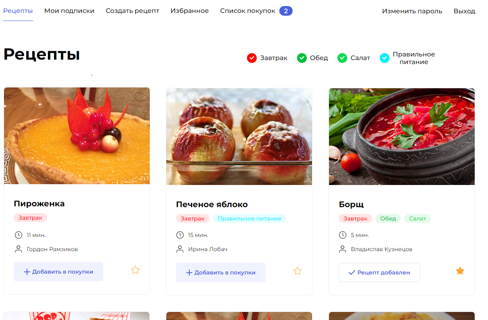
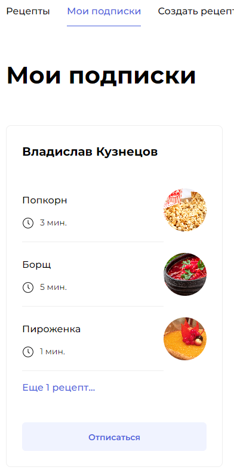
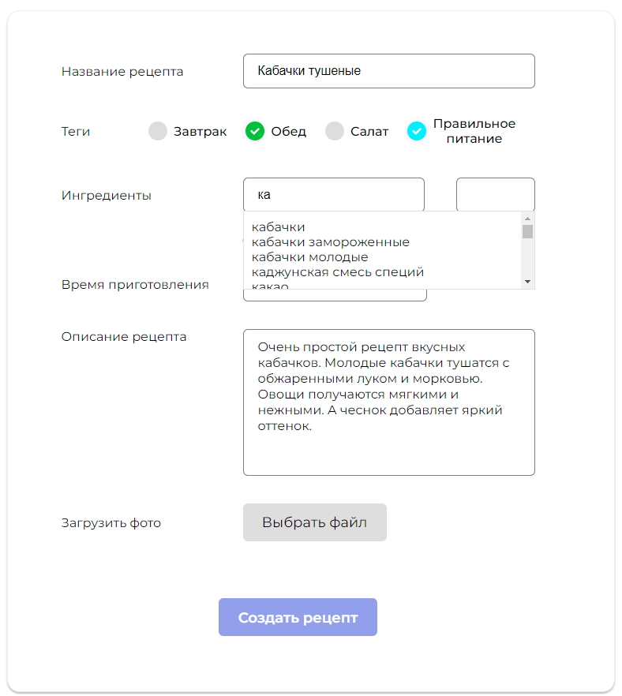

# Описание проекта

Cайт для размещения и просмотра рецептов.

Доступен по адресу: bestrecipes.ddns.net/recipes

Особенности:
* cоздавать рецепты;
* Добавление в избранное;
* Добавление в корзину;
* Скачивание списка ингредиентов к рецептам из корзины;
* Подписки на авторов.

## Технологии
* Frontend: React
* Backand: Django REST API, PostgreSQL, Docker, NGINX, Gunicorn

## Скриншоты:

&nbsp;

&nbsp;

&nbsp;

Как запустить проект:

Клонировать репозиторий и перейти в него в командной строке:

`git clone git@github.com:Dragonwlad/foodgram-project-react.git`

## Как запустить проект локально:

Установить Docker

В корне проекта по шаблону .env.example создать .env, 
установить CURRENT_DB=POSTGRES либо оставить пусттым.

В корневой папке проекта выполнить:

`docker compose up`

Выполнить в консоли команду:

`docker container exec foodgram-project-react-backend-1 python manage.py migrate`

Для создания суперпользователя выполнить команду:

`docker container exec -it  foodgram-project-react-backend-1 python manage.py createsuperuser`

Для импорта базы ингредиентов выполнить команду:

`docker container exec foodgram-project-react-backend-1 python manage.py data_import`

Frontend доступен по адресу: http://localhost:7000/

Админ-панель: http://localhost:7000/admin/

API: http://localhost:7000/api/

## Отдельный запуск Backend:

В папке /backend создать и активировать виртуальное окружение:

`python -m venv venv`

`source venv/Scripts/activate`

Установить зависимости из файла requirements.txt:

`python -m pip install --upgrade pip`

`pip install -r requirements.txt`

По шаблону .env.example создать .env, 
установить DEBUG=True, и CURRENT_DB=SQLite для использования БД SQLite3.

Выполнить миграции:

`python manage.py migrate`

Запуск сервера:

`python manage.py runserver`

## Для запуска на сервере :

Установить Docker

Установить Веб-сервер: Nginx

Создать папку проекта и перейти в нее.

В папке создать файл .env (см. образец env.example)

В папку скопировать docker-compose.production.yml

Выполнить:

`sudo docker compose -f docker-compose.production.yml up -d`

`sudo docker compose -f docker-compose.production.yml exec backend python manage.py migrate`

`sudo docker compose -f docker-compose.production.yml exec backend python manage.py collectstatic --no-input`

`sudo docker compose -f docker-compose.production.yml exec backend cp -r /app/backend_static/. /backend_static/`

## Настройка внешнего Nginx для этого проекта:

sudo nano /etc/nginx/sites-enabled/default

Скопировать и вставить настройки сервера:

server {
    server_name bestrecipes.ddns.net;

    location / {

        proxy_set_header Host $http_host;

        proxy_pass http://127.0.0.1:7000;

        client_max_body_size 20M;

    }
    
}

Проект при деплое на Git/master пушится в Docker-контейнеры и разворачивается на VPS.

## В состав проекта входят 4 контейнера:

* foodgram_gateway - Nginx Web-сервер.
* foodgram_backend - Gunicorn-сервер.
* postgres:13.10 - Сервер базы данных.
* foodgram_frontend - Сборщик статики Node.js.

## Для успешного выполнение Action на GitHub должны быть добавлены следующие переменные:

* DOCKER_USERNAME (имя пользователя DockerHub)
* DOCKER_PASSWORD (пароль DockerHub)
* HOST (IP VPS-сервера)
* USER (Имя пользователя VPS-сервера)
* SSH_KEY (Закрытый ключ VPS-сервера)
* SSH_PASSPHRASE (Пароль VPS-сервера)
* TELEGRAM_TOKEN (Токен Телеграм-канала для уведомлений)
* TELEGRAM_TO (ID пользователя Телеграм)

## Автор:
[Владислав Кузнецов](https://github.com/Dragonwlad)